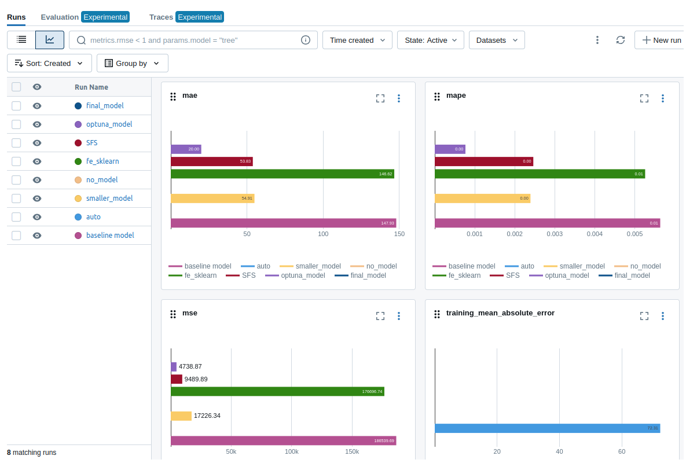
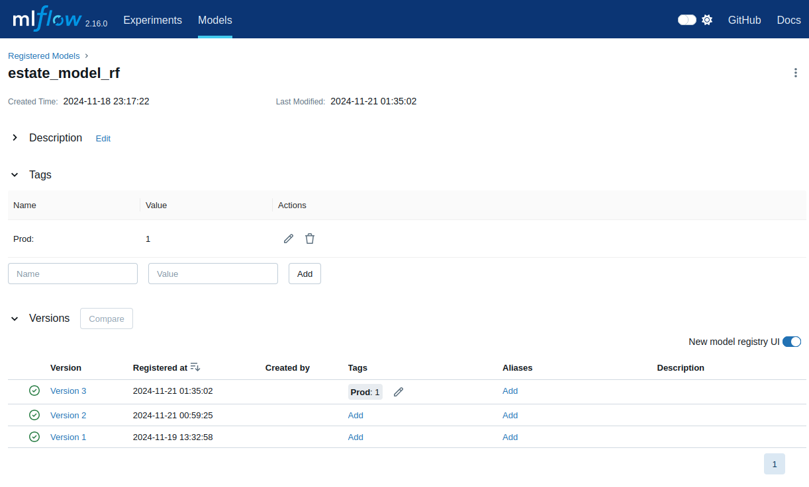
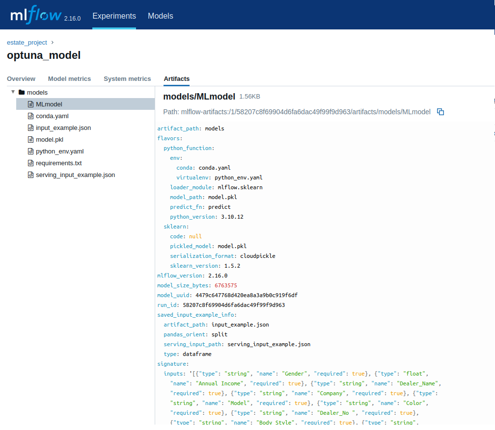

#### Описание проекта
----------------
Проект посвещен изучению данных датасета 'Car_sale', проведению разведочного анализа и нахождению закономерностей в них.

#### Запуск
----------
Для загрузки проекта необходимо, чтобы были предустановлены пакеты:

* git
* python3
* python3-pip

Для запуска проекта необходимо в терминале вашего IDE выполнить команды:
```
* git clone https://github.com/MedvedevIgS/IIS_Lab1.git -b master (Загрузка проекта из репозитория)
* cd IIS_Lab1 (Переход в папку с проектом)
* python3 -m venv my_venv (Создание виртуального окружения)
* .\my_venv\Scripts\activate (Активация виртуального окружения)
* pip install -r requirements.txt (Установка всех зависимостей)
```

#### Исследование данных 
------------
Результат находится в ./eda/eda.ipynb

В ходе исследования были проведены действия:

* Загрузка и знакомство с данными

* Очистка данных
    * Удалены все неправдоподобные записи: 
        * слишком маленькая цена авто
        * слишком маленький доход в год
        * слишком большое соотношение цены авто к доходу
    * Удалены излишние признаки 
* В ходе анализа:
    * Были добавлены новые признаки
        * отоншение цены авто к доходу
        * дата была разбита на год и месяц
        * добавлены нормированные величины цены и дохода
        * была вычислена выручка компаний по годам
    * Было выявлено:
        * доход компаний в 2023 по сравнению с 2022 связан с ростом продаж авто
        * нет прямой корреляции между ценой авто и доходом покупателя
        * сезонность продаж
        * 10 самых продаваемых моделей авто
        * нет сильной корреляции между полом покупателя и компанией производитея авто
        * влияние конфигурации авто на его стоимость
* Обработанная выборка сохранена в файл ./data/clean_data.pkl

#### MLFlow
------------------
##### Запуск MLFlow
```
sh mlflow/script_1.sh
```
Сервис MLFlow будет доступен по адресу: http://localhost:5000



Зарегистрированные версии моделей



Текстовый файл MLModel



Лучший результат показала модель optuna_model, импользующая RandomForestRegressor.

Метки качества модели:

* mae - 20.943
* mape - 0.000752
* mse - 6135.125

Эта модель, показавшая наилучшый результат была обучена на всей выборке. Run_id модкли - 58207c8f69904d6fa6dac49f99f9d963.
